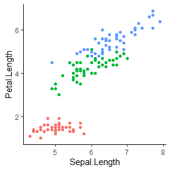

<!-- README.md is generated from README.Rmd. Please edit that file -->

ggx 
================================================================

Overview
--------

This package is an add-on to `ggplot2`, the R package for creating
awesome graphics, which is based on [The Grammar of
Graphics](https://amzn.to/2ef1eWp). `ggplot2` has changed my life as a
scientist and developer. However, I have terrible memory and I forget
the same commands again and again. Like, how do you rotate axis labels
again? Or how do you hide the legend…? So I often end up searching the
net for help and then I copy and paste the solution I find into my R
script. And I know at least one more person who does this, too.
Eventually, I wondered whether we couldn’t save this extra step and just
*talk* to ggplot in natural language (similar to a Google search query).
So, I wrote this package that lets us issue natural language commands,
which then are translated into ggplot commands. This is very likely
totally bonkers, and this is how it looks (watch the `gg_` commands
below):

    ggplot(data=cars,aes(x=speed, y=dist))+geom_point()+
      gg_("rotate x-axis labels by 90 degrees")+
      gg_("increase font size on x-axis")

Disclaimer
----------

I am pretty sure that this package violates fundamental principles of
ggplot2. First and foremost, it would be much wiser to just study and
learn the respective commands instead of relying on fuzzy and not
well-defined natural language commands. Second, this package doesn’t
rely on fancy deep learning or other AI technology. It’s a simple
keyword matching algorithm. If someone fancies to replace this with a
better approach, please do so. Contributions to this package are more
then welcome!

Installation
------------

    # Install the development version from GitHub:
    # install.packages("devtools")
    devtools::install_github("brandmaier/ggx")

Usage Examples
--------------

This package has two basic modes of operations. Either you use the
`gg_(...)` command to generate ggplot2 elements from natural language
and chain them directly to your plotting commands (for lazy people), or
you use the package as a reminder of the command and let the package
print out the command, which you then copy and paste to your code (safer
option). In the following, I will give you a few examples of how the
package could be used.

    ggplot(data=iris, 
           mapping=aes(x=Sepal.Length, 
                      y=Petal.Length, color=Species))+
      geom_point()+
      gg_("hide legend")

Or,

    ggplot(data=iris, 
           mapping=aes(x=Sepal.Length, 
                      y=Petal.Length, color=Species))+
      geom_point()+
      gg_("rotate x-axis labels by 90°")

Or,

    ggplot(data=iris, 
           mapping=aes(x=Sepal.Length, 
                      y=Petal.Length, color=Species))+
      geom_point()+
      gg_("double the font size on the x-axis")

If you want to go the safer route, just use the `ggx` package as
personal assistant that helps you find solutions to common graph
formatting problems, like in the following:

    gghelp("How can I hide the graph legend?")
    #> theme(legend.position = "none")

Or,

    gghelp("I want to flip my x-axis and y-axis.")
    #> coord_flip()

Or,

    gghelp("How can I increase the font size on the x axis?")
    #> theme(axis.title.x=element_text(size=rel(2)))

Disclaimer (continued)
----------------------

This package is just a quick and dirty implementation of a keyword
matching algorithm. Do not expect any deeper language processing.
Neither is this program a therapist (see Eliza or others). Also, the
program doesn’t aim for completeness. It just knows a couple of commands
that I tend to forget. Don’t be mad if you hate the package. Just ignore
it and write beautiful ggplot code without it. If you like the package,
think about contributing to it. Add more questions, keywords, etc. I
welcome any contribution, preferably via pull requests on github.
